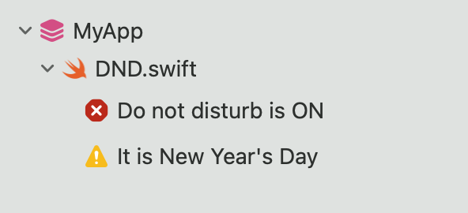

# DoNilDisturb Swift Plugin

Use Xcode 14+ to make use of this amazing and novel Swift plugin in your package.

The plugin stops you from working on your 9-5 project outside of 9-5 hours:


Add this to your dependencies in your Package.swift:

```swift
.package(url: "https://github.com/icanzilb/DoNilDisturbPlugin.git", from: "0.0.2"),
```

**And then**, add the plugin in your target definition(still in Package.swift:

```swift
.target(
  name: "MyTarget",
  plugins: [
    .plugin(name: "DoNilDisturbPlugin", package: "DoNilDisturbPlugin")
  ]
)
```

That's all. Your target will fail to build outside of working hours.

Enjoy your time off work.

## Public Holidays support

Grab an **.ics** file containing the public holidays for your locality. For example, grab this one for Spanish holidays: https://www.officeholidays.com/ics-clean/spain

Save the calendar file under your project's root directory in a sub-directory called `.config/DoNilDisturb`

The plugin will now respect your holidays:



## License

MIT, of course.